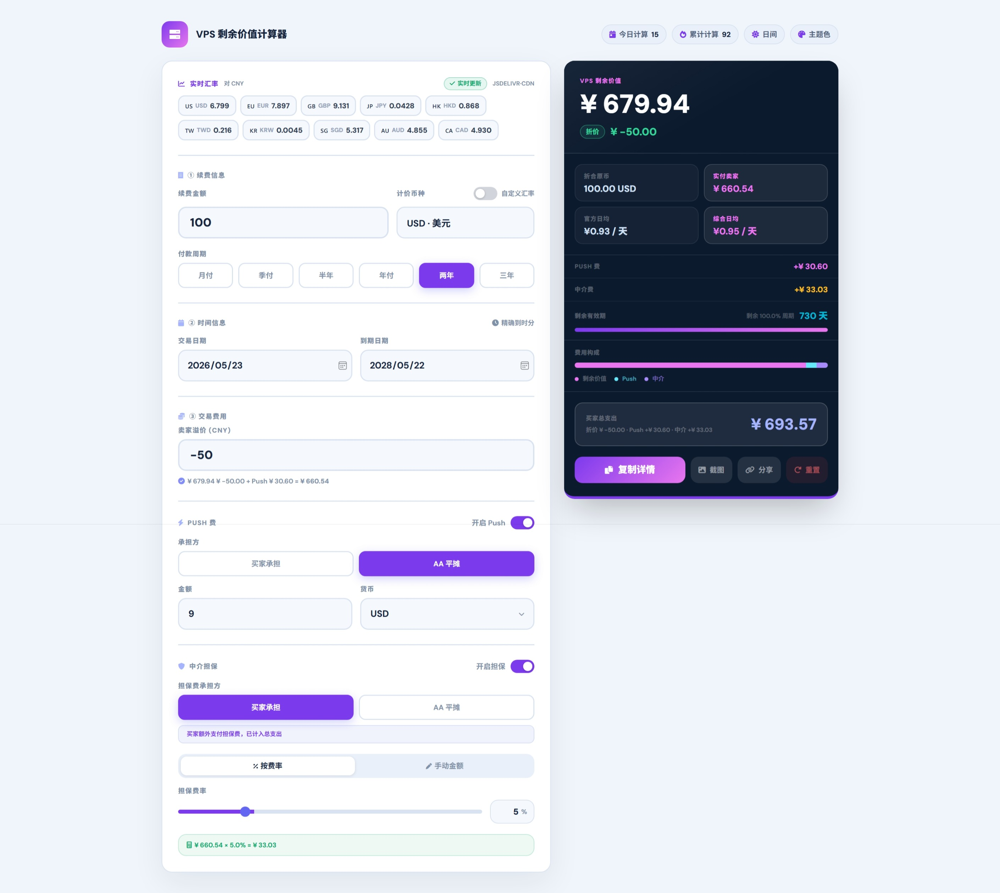
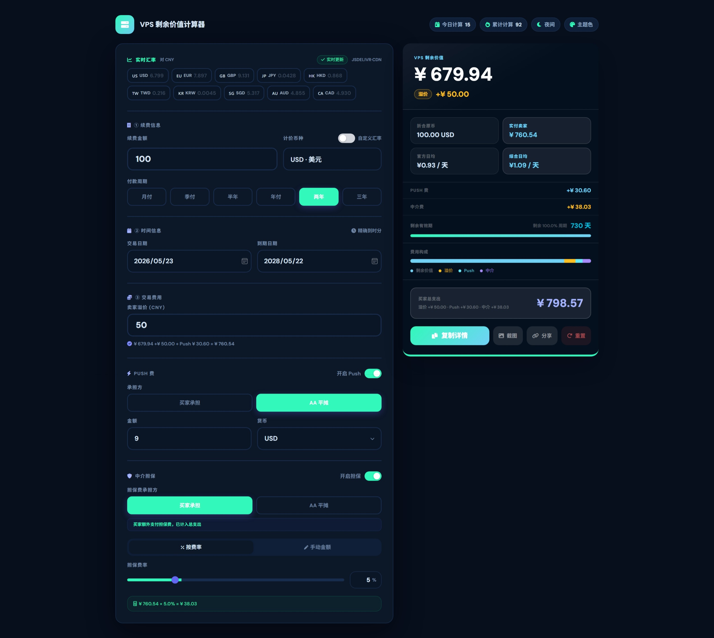

# VPS 剩余价值计算器

<div align="center">

🚀 一个专业的VPS服务器剩余价值计算工具

本项目基于 [coco20652-netizen/vps-calculator](https://github.com/coco20652-netizen/vps-calculator) 进行优化修改。

</div>

## 📋 简介

VPS 剩余价值计算器是一个强大的Web应用，专为需要精确计算VPS或其他服务器商品剩余价值的用户设计。支持多货币、自定义汇率、费用计算等高级功能，帮助买卖双方快速准确地确定交易价格。

**适用场景：**
- 🔄 VPS / 云服务器二手交易
- 💳 续费价值计算
- 📊 交易报告生成
- 🤝 买卖双方谈判工具

---

## ✨ 功能特性

### 核心计算功能
- **剩余价值计算** - 基于续费金额、剩余有效期自动计算剩余价值
- **多货币支持** - 内置USD、EUR、GBP、JPY、CNY等主流货币汇率
- **自定义汇率** - 支持实时输入自定义汇率覆盖默认值
- **灵活周期设置** - 预设周期（30/90/180/365天）或自定义日期范围
- **续费溢价/折价** - 支持计算卖家溢价或折价比例

### 费用管理
- **Push费用** - 支持添加平台手续费，可自定义买卖双方承担比例
- **中介费用** - 支持三种中介费计算模式：
  - 固定金额
  - 百分比比例
  - 混合模式（固定 + 百分比）
- **灵活分摊** - 费用可由买家或卖家承担

### 用户体验
- **深色/浅色主题** - 自适应系统主题，支持手动切换
- **响应式设计** - 完美适配桌面、平板、手机等各尺寸设备
- **数据持久化** - 自动保存配置到本地存储（localStorage）
- **实时计算** - 输入变化时即时更新所有计算结果
- **详情复制** - 一键复制格式化报告到剪贴板
- **分享链接** - 生成包含所有参数的分享链接，方便协作
- **图片导出** - 将计算报告导出为PNG图片

### 高级功能
- **时间精度切换** - 支持日期或日期时间精度计算
- **日均成本分析** - 自动计算买家每日平均支出
- **配置导入导出** - 通过URL参数快速恢复或分享配置
- **本地数据存储** - 无需后端，所有数据在本地处理，隐私安全

## 界面预览

### 日间模式


### 夜间模式


---

## 🚀 快速开始

### 在线使用

直接下载 `index.html` 文件到Web目录即可使用，无需任何安装或配置。


### 本地使用

1. 下载 `index.html` 文件
2. 双击在浏览器中打开，或右键选择"用浏览器打开"
3. 开始计算！

---

## 📖 使用指南

### 基础计算

1. **输入续费金额** - 在"续费金额"字段输入金额
2. **选择货币** - 从货币选择器选择或自定义汇率
3. **设置周期** - 选择预设周期或自定义交易日期和过期日期
4. **查看结果** - 右侧面板实时显示计算结果

### 高级功能

#### 自定义汇率
- 启用"自定义汇率"开关
- 输入你的汇率值（如 1 USD = X CNY）
- 计算将使用你的汇率而非默认值

#### 添加Push费用
- 启用"Push费用"开关
- 输入费用金额
- 选择费用所在的货币
- 选择由买家或卖家承担

#### 中介费用（两种模式）
- **固定模式** - 输入固定金额的中介费
- **百分比模式** - 输入百分比（如 5%）
- 选择由买家或卖家承担

#### 生成报告
- 点击"📋 复制详情" - 复制格式化文本报告
- 点击"🔗 分享链接" - 生成包含所有参数的分享URL
- 点击"📸 保存图片" - 导出为PNG图片

---

## 🛠 技术栈

- **HTML5** - 语义化标记
- **CSS3** - 使用CSS变量实现主题系统
- **Vanilla JavaScript** - 纯JS开发，无框架依赖
- **Tailwind CSS** - 实用优先的CSS框架（CDN引入）
- **Font Awesome** - 图标库（CDN引入）
- **html-to-image** - 图片导出功能

### 外部依赖
```html
<!-- Tailwind CSS -->
<script src="https://cdn.tailwindcss.com"></script>

<!-- Font Awesome Icons -->
<link rel="stylesheet" href="https://cdnjs.cloudflare.com/ajax/libs/font-awesome/6.0.0/css/all.min.css">

<!-- HTML to Image (可选，用于截图功能) -->
<script src="https://cdnjs.cloudflare.com/ajax/libs/html2canvas/1.4.1/html2canvas.min.js"></script>
<script src="https://cdn.jsdelivr.net/npm/html-to-image@1.11.11/dist/index.js"></script>

<!-- Google Fonts -->
<link href="https://fonts.googleapis.com/css2?family=DM+Sans:wght@400;500;700;900&display=swap" rel="stylesheet">
```

---

## 🎨 主题系统

应用支持亮色和暗色两种主题：

- **自动检测** - 默认根据系统偏好设置（`prefers-color-scheme`）
- **手动切换** - 点击页面右上角月亮/太阳图标切换
- **CSS变量驱动** - 所有颜色通过CSS变量定义，便于定制

### 自定义主题

编辑 `:root` 和 `:root[data-theme="dark"]` 的CSS变量：

```css
:root {
  --bg: #f0f5fb;           /* 背景色 */
  --card: #ffffff;         /* 卡片背景 */
  --accent: #3b5bdb;       /* 主题色 */
  --txt: #18253e;          /* 文字色 */
  /* ... 更多变量 */
}
```

---

## 💾 数据存储

- 所有配置自动保存到浏览器的 `localStorage`
- 存储key：`vps_cfg`
- 支持自动恢复上次的配置
- 点击"🔄 重置"按钮可清除所有保存数据

### 存储的数据包括
- 续费金额和货币
- 交易日期和过期日期
- 周期设置
- 自定义汇率
- Push费用配置
- 中介费用配置
- 所有费用分摊选择

---

## 🔗 URL参数分享

生成的分享链接包含以下参数：

```
?amt=100&cur=USD&sd=2024-01-01&ed=2024-12-31&prem=10&...
```

支持的参数：
- `amt` - 续费金额
- `cur` - 货币
- `sd` - 交易日期
- `ed` - 过期日期
- `cd` - 周期天数
- `prem` - 溢价/折价百分比
- `pf` - Push费用
- `pp` - Push费用承担方
- `um` - 使用中介费
- `mm` - 中介费模式
- 更多...

---

## 📱 浏览器兼容性

- ✅ Chrome / Edge (最新版本)
- ✅ Firefox (最新版本)
- ✅ Safari 14+
- ✅ iOS Safari 14+
- ✅ Android Chrome

需要支持 localStorage、ES6 JavaScript 和 CSS Grid/Flexbox。

---

## 🐛 常见问题

### Q: 为什么无法导出图片？
**A:** 确保：
1. 使用现代浏览器（Chrome, Firefox, Safari等）
2. html-to-image库已正确加载（检查网络连接）
3. 浏览器没有阻止跨域资源

### Q: 如何离线使用？
**A:** 下载 `index.html` 文件，直接在浏览器打开即可。所有功能都能工作（除了图片导出需要网络加载库文件）。

### Q: 数据会被保存吗？
**A:** 会的。所有数据保存在本地浏览器的 localStorage 中，关闭浏览器后数据仍然保留。清除浏览器缓存会删除数据。

### Q: 支持哪些货币？
**A:** 内置支持 USD、EUR、GBP、JPY、CNY 等主流货币。支持自定义汇率对其他货币进行计算。

### Q: 汇率数据从何而来？
**A:** 汇率数据内置在应用中，不会实时更新。如需最新汇率，使用"自定义汇率"功能输入当前汇率。

### Q: 可以修改代码吗？
**A:** 可以！本项目使用MIT许可证，欢迎Fork、修改和分发。

---

<div align="center">

**[⬆ 返回顶部](#vps-剩余价值计算器)**

</div>
